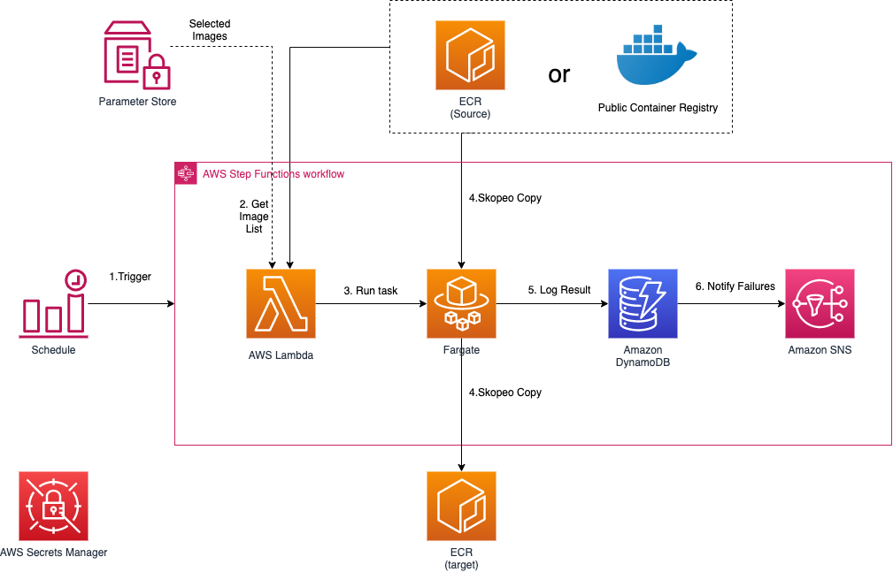

[中文](./README_CN.md)

# Data Replication Hub - ECR Plugin

## Table of contents
* [Introduction](#introduction)
* [Architect](#architect)
* [Deployment](#deployment)
  * [Before Deployment](#before-deployment)
  * [Available Parameters](#available-parameters)
  * [Deploy via AWS Cloudformation](#deploy-via-aws-cloudformation)
  * [Deploy via AWS CDK](#deploy-via-aws-cdk)
* [FAQ](#faq)

## Introduction

[AWS Data Replication Hub](https://github.com/awslabs/aws-data-replication-hub) is a solution for replicating data from different sources into AWS. This project is for ECR replication plugin. Each of the replication plugin can run independently. 

The following are the planned features of this plugin.

- [x] Amazon ECR replication between AWS accounts or regions
- [x] Amazon ECR replication between AWS Standard partition and AWS CN partition
- [x] Public docker registry to AWS ECR replication
- [ ] Private docker registry to AWS ECR replication
- [x] Replicate all images or only selected Images
- [x] Support One-time replication
- [x] Support Incremental replication

This plugin uses [**skopeo**](https://github.com/containers/skopeo) as the tool to copy images to Aamazon ECR. If same layer already exists in target ECR, it will not be copied again.


## Architect




High level process is described as below

1. EventBridge Rule to trigger Step functions to execute on a regular basis. (By default, daily)
1. Step functions will invoke Lambda to get the list of images from source. 
1. Lambda will either list all the repositorys in the source ECR or get the stored selected image list from System Manager Parameter Store.
1. The replication task will be run within Fargate in a max concurrency of 10. If a replication task failed for some reason, it will automatically retry for 3 times.
1. Each task uses `skopeo copy` to copy the images into target ECR
1. Once copy is completed, the status (either success or failed) will be logged into DynamoDB for tracking purpose


## Deployment

Things to know about the deployment of this plugin:

- The deployment will automatically provision resources like lambda, dynamoDB table, ECS Task Definition in your AWS account, etc.
- The deployment will take approximately 3-5 minutes.
- Once the deployment is completed, the data replication task will start right away.

###  Before Deployment

- Configure **credentials**

If source (or destination) is NOT in current AWS account, you will need to provide `AccessKeyID` and `SecretAccessKey` (namely `AK/SK`) to pull from or push to Amazon ECR. And a Parameter Store is used to store the credentials in a secure manner.

Please create a parameter in **Parameter Store** from **AWS Systems Manager**, you can use default name `drh-credentials` (optional), select **SecureString** as its type, and put a **Value** following below format.

```
{
  "access_key_id": "<Your Access Key ID>",
  "secret_access_key": "<Your Access Key Secret>"
}
```

> Note: If source type is Public, there is no need to provide the source credentials.

- Set up **ECS Cluster** and **VPC**

The deployment of this plugin will launch an ECS Task running in Fargate in your AWS Account, hence you will need to set up an ECS Cluster and the VPC before the deployment if you haven't got any. 

> Note: For ECS Cluster, you can choose **Networking only** type. For VPC, please make sure the VPC should have at least two subnets across two available zones.


### Available Parameters

The following are the all allowed parameters for deployment:

| Parameter                 | Default          | Description                                                                                                               |
|---------------------------|------------------|---------------------------------------------------------------------------------------------------------------------------|
| sourceType                | Amazon_ECR       | Choose type of source container registry, for example Amazon_ECR, or Public from Docker Hub, gco.io, etc.                 |
| srcRegion                 | ''               | Source AWS Region (only required if source type is Amazon ECR).                                                           |
| srcAccountId              | ''               | Source AWS Account ID (only required if source type is Amazon ECR), leave it blank if source is in current account.       |
| srcList                   | ALL              | Type of Source Image List.  Either ALL or SELECTED                                                                        |
| srcImageList              | ''               | Source Image List delimited by comma, for example, ubuntu:latest,alpine:latest... If srcList is ALL, this will be ignored.|
| srcCredential             | ''               | The Parameter in System Managers used to keep credentials to pull images from source.                                     |
| destRegion                | ''               | Destination AWS Region.                                                                                                   |
| destAccountId             | ''               | Destination AWS Account ID, leave it blank if destination is in current account.                                          |
| destPrefix                | ''               | Destination Prefix (Leave blank, Not required for now)                                                                    |
| destCredential            | ''               | The Parameter in System Managers used to keep destination credentials to push images to Amazon ECR.                       |
| ecsClusterName            | <requires input> | ECS Cluster Name to run ECS task                                                                                          |
| ecsVpcId                  | <requires input> | VPC ID to run ECS task, e.g. vpc-bef13dc7                                                                                 |
| ecsSubnetA                | <requires input> | Subnet IDs to run ECS task. Please provide two subnet IDs for high availability.                                          |
| ecsSubnetB                | <requires input> | Subnet IDs to run ECS task. Please provide two subnet IDs for high availability.                                          |
| alarmEmail                | ''               | Alarm Email address to receive notification in case of any failure.                                                       |


### Deploy via AWS Cloudformation

Please follow below steps to deploy this plugin via AWS Cloudformation.

1. Sign in to AWS Management Console, switch to the region to deploy the CloudFormation Stack to.

1. Click the following button to launch the CloudFormation Stack in that region.

    - For Standard Partition

    [](https://console.aws.amazon.com/cloudformation/home#/stacks/create/template?stackName=DataReplicationECRStack&templateURL=https://aws-gcr-solutions.s3.amazonaws.com/Aws-data-replication-component-ecr/latest/AwsDataReplicationComponentEcrStack.template)

    - For China Partition

    [](https://console.amazonaws.cn/cloudformation/home#/stacks/create/template?stackName=DataReplicationECRStack&templateURL=https://aws-gcr-solutions.s3.cn-north-1.amazonaws.com.cn/Aws-data-replication-component-ecr/latest/AwsDataReplicationComponentEcrStack.template)
    
1. Click **Next**. Specify values to parameters accordingly. Change the stack name if required.

1. Click **Next**. Configure additional stack options such as tags (Optional). 

1. Click **Next**. Review and confirm acknowledgement,  then click **Create Stack** to start the deployment.

If you want to make custom changes to this plugin, you can follow [custom build](CUSTOM_BUILD.md) guide.

> Note: You can simply delete the stack from CloudFormation console if the replication task is no longer required.

### Deploy via AWS CDK

If you want to use AWS CDK to deploy this plugin, please make sure you have met below prerequisites:

* [AWS Command Line Interface](https://aws.amazon.com/cli/)
* Node.js 12.x or later

Under the project **source** folder, run below to compile TypeScript into JavaScript. 

```
cd source
npm install -g aws-cdk
npm install && npm run build
```

Then you can run `cdk deploy` command to deploy the plugin. Please specify the parameter values accordingly, for example:

```
cdk deploy \
--parameters sourceType=Amazon_ECR \
--parameters srcRegion=eu-west-1 \
--parameters destAccountId=123456789012 \
--parameters destCredential=drh-credentials \
--parameters destRegion=cn-northwest-1 \
--parameters ecsClusterName=testcluster \
--parameters ecsVpcId=vpc-123456 \
--parameters ecsSubnetA=subnet-1234567 \
--parameters ecsSubnetB=subnet-1234568
```

> Note: You can simply run `cdk destroy` if the replication task is no longer required. This command will remove the stack created by this plugin from your AWS account.


## FAQ

to be updated.